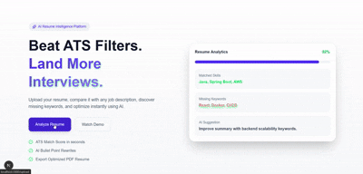

# ATS Resume Intelligence Client

Frontend application for the ATS Resume Intelligence Platform.  
Built to help users upload resumes, compare them against job descriptions, receive ATS scores, and apply AI-powered resume improvements through an interactive editor.

---

## Overview

This client application provides a complete user-facing workflow for resume optimization.

Users can:

- Upload a resume PDF
- Paste a job description
- Analyze ATS compatibility
- Review matched and missing keywords
- Edit resume sections
- Apply AI-generated suggestions
- Improve summaries and bullet points
- Optimize resumes for recruiter visibility

---

## Product Demo

See full workflow:

- Resume Upload
- ATS Score Generation
- Missing Keyword Detection
- AI Suggestions
- Resume Editor


- 
## Key Features

## Resume Upload Flow

- Upload PDF resume files
- Paste target job description
- Submit for analysis

## Smart Analysis Loader

Displays real-time workflow progress such as:

- Resume parsed
- ATS score calculating
- AI optimization in progress

## ATS Results Dashboard

Displays:

- ATS Score
- Matched Keywords
- Missing Keywords
- Resume Improvement Suggestions

## Resume Editor

Editable sections include:

- Summary
- Experience
- Projects
- Skills
- Education

## AI Suggestions Panel

One-click actions:

- Replace Summary
- Add Experience Bullet Points
- Improve Resume Content

---

## Screens Included

- Upload Page
- Analysis Loading Screen
- Results Dashboard
- Resume Editor with AI Suggestions

---

## Tech Stack

### Frontend

- React
- TypeScript / JavaScript
- HTML5
- CSS3

### API Integration

- Axios / Fetch API
- FastAPI Backend

### UX

- Responsive Layout
- Interactive Forms
- Dynamic State Updates

---

## Application Flow

```text
Upload Resume + Paste JD
        |
        v
Submit Request
        |
        v
Loading / Analysis Screen
        |
        v
Results Dashboard
        |
        v
Resume Editor
        |
        v
Apply AI Suggestions
        |
        v
Export / Use Updated Resume
```

## Backend Dependency
This frontend connects to the backend platform:
```
https://github.com/jeet7122/ats_resume_intelligence_platform
```

### Backend responsibilities:

* PDF parsing 
* Resume section extraction 
* ATS scoring 
* Missing keyword detection 
* AI optimization 
* Structured JSON responses

### Future Enhancements
- Resume PDF export 
- Authentication 
- Resume history 
- Multiple templates 
- Live job scraping 
- Dark mode 
- Cover letter generator